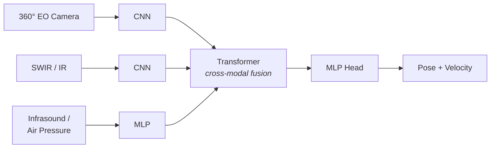

# Project ARGUS

**A high-altitude, solar-powered glider that detects and tracks hypersonic cruise missiles**

Hypersonic cruise missiles (HCMs) fly low, fast (~Mach 5), and maneuver to slip
under and around ground radar. ARGUS answers that with persistence and altitude
instead of power: a passive, solar-powered HAPS (High-Altitude Pseudo-Satellite)
glider loitering in the stratosphere, looking *up and out* against a cold sky,
fusing infrasound, SWIR, and electro-optical cues to call a track without ever
needing the target's exact coordinates. One node sees a slice; a mesh of them
sees the theater.

> Built at the **5/02–03 National Security Hackathon**.

---

## The four pillars

This repo carries the project end to end — airframe, avionics, the detection
algorithm, and the system economics that make a fleet viable.

| Pillar | What's here | Where |
|---|---|---|
| ✈️ **Airframe** | Parametric Fusion 360 HAPS solar glider (Zephyr-inspired) | [`CAD/`](CAD/) |
| 🔌 **Electronics** | Power schematic, wiring, system block diagram, BOM | [`Electronics/`](Electronics/) |
| 🧠 **Detection** | Godot intercept simulation + sensor-fusion AI + PyTorch model | [`simulation/`](simulation/) |
| 📊 **Feasibility** | Physics-based design optimizer + fleet-economics report | [`reports/`](reports/) |

---

## How detection works

ARGUS never trusts a single sensor and never assumes it knows where the threat
is. Three passive modalities feed per-modality encoders; a fusion stage resolves
cross-modal agreement into a target **pose + velocity** estimate.



The sensors are deliberately tiered by cost and power, and gated by a state
machine so the platform spends its tiny solar power budget only when a threat is
real:

- **Infrasound** — always-on tripwire. Long range, low SNR; HCMs radiate
  low-frequency acoustic energy that carries for hundreds of km.
- **SWIR (InGaAs)** — thermal verification. Looks *up* against the cold
  stratospheric background where a hot missile body stands out.
- **EO camera** — high-fidelity visual confirmation, short range.

```
IDLE  ──anomaly──▶  DETECT  ──thermal lock──▶  TRACK  ──visual ID──▶  ENGAGE
                                                          (satellite uplink only here)
```

When the missile's plasma sheath causes an RF blackout, the fuser leans harder
on the IR + acoustic channels instead of failing. See
[`simulation/README.md`](simulation/README.md) for the full mapping of
requirements to implementation.

---

## Run the simulation

The Godot sim is where the fusion and power-management logic were built and
validated — a live intercept scenario you can fly.

```bash
# 1. Install Godot 4.3+ (Standard build, not .NET)
# 2. Godot → Import → simulation/project.godot
# 3. Press F5
```

**Controls:** `R` respawn the HCM on a new heading · `T` toggle the ground-truth
marker · `C` cycle camera (orbit / chase ARGUS / chase HCM).

### The local AI model

A tiny PyTorch MLP (~5.4k params) that replaces the analytic fuser, trained on
synthetic engagements and small enough to run on an edge TPU:

```bash
cd simulation/ml
python3 gen_dataset.py --episodes 800 --steps 150 --out dataset.npz
python3 train.py --device cpu --epochs 20 --out argus_model.pt
python3 infer.py --demo      # predictions vs. truth
python3 infer.py --serve     # UDP bridge on 127.0.0.1:9999 → into Godot
```

It ingests a 16-feature sensor vector and outputs target-presence probability
plus coarse range/speed. Details in [`simulation/ml/README.md`](simulation/ml/README.md).

---

## Does it actually close?

The optimizer in [`reports/`](reports/) sweeps the design space against hard
physics constraints (energy balance, stall margin, wing loading, structural
span) and the mission requirement: persistent coverage of **500,000 km²** at
**55–75 kft** with **7+ day** endurance. It found **46,335 feasible designs**
and surfaced an optimum per sensor tier.

**Recommended configuration — COTS Enhanced** (8.0 m span, AR 26.7, GaAs
multi-junction solar, full COTS sensor suite + onboard ML):

| Metric | Value |
|---|---|
| Per-aircraft cost | **~$7,500** (commodity parts) |
| Endurance | Solar-perpetual (maintenance-limited, ~30 days) |
| Loiter altitude | 55,000 ft / 16.8 km |
| Aerodynamic efficiency | L/D ≈ 49 |
| Detection range (per node) | 75 km, Pd 0.65 |
| **Fleet detection (overlapping nodes)** | **Pd 0.99** |
| Fleet to cover 500,000 km² | **68 aircraft, ~$507k total** |
| Cost per km² of persistent coverage | **~$1.01** |

The thesis in one line: a single node is a coin flip (Pd 0.65), but **overlap +
fusion across a cheap mesh drives detection to 0.99** — and the whole theater
costs about a dollar per square kilometer to watch.

```bash
cd reports
python3 run_optimizer.py        # prints the trade study
# full results: reports/argus_optimization_report.json
```

---

## Repository layout

```
.
├── CAD/             Parametric Fusion 360 airframe (HAPS solar glider) + meshes
├── Electronics/     Power schematic, wiring, system block diagram, BOM
├── simulation/      Godot 4.3 intercept sim
│   ├── scripts/     Drone, target, sensors, fusion, power manager, HUD (GDScript)
│   └── ml/          PyTorch fusion model + dataset/train/infer + UDP bridge
├── reports/         Design optimizer (argus_engine.py) + feasibility report
├── architecture.md  Sensor-fusion AI architecture (diagram)
└── Project Description.pdf
```

---

## Design highlights

- **Passive by design** — no active radar to jam or geolocate; ARGUS listens and
  looks rather than emitting.
- **Power-gated sensing** — the `IDLE → DETECT → TRACK → ENGAGE` ladder keeps the
  aircraft inside a stratospheric solar budget of tens of watts.
- **Coordinate-free estimation** — the fuser reads only sensor outputs (bearings,
  intensities, anomaly scores) and never the truth state, mirroring real
  operational constraints.
- **Built for a mesh** — long-baseline TDOA infrasound (wingtip + boom mics) and
  graceful degradation mean the fleet keeps working as nodes drop.
- **COTS economics** — the recommended build is assembled from commodity sensors
  and carbon-fiber structure, designed to be attritable.

---

*Phase 1 deliverable: simulation + airframe + feasibility. The fusion estimator's
`update()` seam is where a Phase-3 trained policy plugs in — the analytic fuser
and the neural model share the same interface.*
